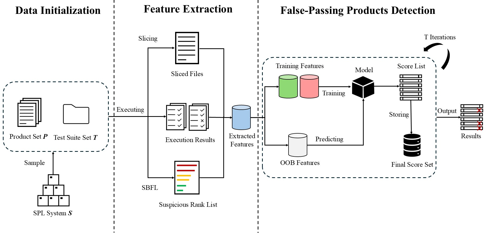

# PULP

PULP is the artifact repository for our study on detecting and mitigating
false-passing variants in configurable software systems.  The repository
contains the implementation used to label variants, extract consistency and
spectrum-based features, classify false-passing variants, run ablation studies,
and evaluate the downstream effect on spectrum-based fault localization.

The main entry point is [`PULP.py`](./PULP.py).  Individual stages are exposed as
Python functions so that each research question can be reproduced independently.

## Overview

In configurable systems, a variant may pass the available test suite even though
it still contains faulty feature code or faulty statements.  PULP treats these
variants as **false-passing variants (FP)** and separates them from **true-passing
variants (TP)** and failing variants (F).  The pipeline is:

1. Label the ground truth FP/TP/F variants.
2. Extract variant-level features from test coverage, suspicious statements, and
   slicing information.
3. Train and evaluate false-passing-variant detectors under different
   experimental settings.
4. Remove or mitigate detected FP variants before fault localization.
5. Summarize the resulting ranking quality.

## Architecture

The following figure summarizes the PULP workflow.



The PDF version of the same figure is available at
[`pdf/fp-overview.pdf`](pdf/fp-overview.pdf).

## Repository Layout

| Path | Purpose |
| --- | --- |
| [`PULP.py`](./PULP.py) | Main script for configuring systems and invoking experiment stages. |
| [`consistent_testing_manager/`](./consistent_testing_manager) | Ground-truth labeling and feature extraction for TP/FP/F variants. |
| [`fp_detection/`](./fp_detection) | False-passing-variant detectors, including PU bagging, KNN, K-means, one-class SVM, isolation forest, and two-step PU learning. |
| [`ranking/`](./ranking) | Variant-level and statement-level ranking logic used by the fault-localization evaluation. |
| [`spectrum_manager/`](./spectrum_manager) | Coverage-spectrum parsing and spectrum-expression utilities. |
| [`suspicious_statements_manager/`](./suspicious_statements_manager) | Suspicious statement extraction and slicing support. |
| [`fl/`](./fl) | Fault-localization evaluation and result aggregation. |
| [`experimental_results_analyzer/`](./experimental_results_analyzer) | Scripts for comparing and summarizing experimental results. |
| [`projects/`](./projects) | Subject SPL project templates and feature models. |
| [`plugins/`](./plugins) | Third-party tools and Java artifacts used by the pipeline. |
| [`statistics/`](./statistics) | Example log files from classification and ablation experiments. |
| [`pdf/`](./pdf) | Overview figure used in the paper and in this README. |
| `summary*.xlsx`, [`results.csv`](./results.csv) | Aggregated result files produced by prior runs. |

## Environment

The artifact was developed and tested with Python 3.7/3.x and Java-based SPL
tooling.  A local virtual environment is included in `venv/`, but for a clean
reproduction we recommend creating a fresh environment.

Install the Python dependencies used by the scripts:

```bash
python -m venv .venv
source .venv/bin/activate        # Linux/macOS
# .venv\Scripts\activate         # Windows PowerShell
pip install numpy pandas scipy scikit-learn numba beautifulsoup4 matplotlib seaborn openpyxl xlsxwriter requests
```

The Java tools required by the pipeline are already included under
[`plugins/`](./plugins), including FeatureHouse, SPLCATool, EvoSuite, JUnit, Ant,
and slicing utilities.

## Dataset Setup

The original benchmark data can be obtained from:

<https://tuanngokien.github.io/splc2021/>

PULP expects each benchmark system to be organized by system name and bug count,
for example:

```text
D:/BuggyVersions/
  BankAccountTP/
    4wise-BankAccountTP-1BUG-Full/
    4wise-BankAccountTP-2BUG-Full/
    4wise-BankAccountTP-3BUG-Full/
  Elevator-FH-JML/
    4wise-Elevator-FH-JML-1BUG-Full/
    ...
```

Before running an experiment, update the `system_paths` dictionary in
[`PULP.py`](./PULP.py) so that each entry points to the local benchmark folders
on your machine.  The script currently contains both Linux-style examples and
Windows-style examples.

## Reproducing the Pipeline

The workflow is controlled by uncommenting the desired function call in
[`PULP.py`](./PULP.py).  The most common end-to-end sequence is:

### 1. Label variants

If `label_data` is not already imported in your local copy of `PULP.py`, add:

```python
from consistent_testing_manager.LabelData import label_data
```

Then invoke:

```python
label_data(system_paths)
```

This stage creates `variant_labels.csv` files inside mutated-project folders.
Labels are:

| Label | Meaning |
| --- | --- |
| `F` | Failing variant. |
| `TP` | True-passing variant. |
| `FP` | False-passing variant. |

### 2. Extract features

```python
calculate_attributes_from_system_paths(system_paths)
```

This stage creates per-version feature files such as `attributes.csv`.  The
features combine consistency, coverage, suspiciousness, and slicing-derived
signals used by the FP detectors.

### 3. Run FP-variant classification

PULP supports several evaluation settings:

```python
within_system_classification(system_paths)
dataset_based_classification(system_paths, "cross_system.log")
product_based_classification(system_paths)
version_based_classification(system_paths)
system_based_classification(system_paths)
```

Typical logs are written to [`statistics/`](./statistics) or to the log path
passed to the function.  The logs report precision, recall, F1, and accuracy for
TP and FP variants.

### 4. Run ablation analysis

```python
ablation_analysis(system_paths, "statistics/ablation.log")
ablation_analysis2(system_paths, "statistics/ablation_sbfl.log")
```

These functions evaluate feature-group contributions and write the corresponding
classification metrics to the selected log file.

### 5. Evaluate fault localization after FP mitigation

```python
fl_with_fp("D:/splfl/", system_paths)
calculate_average_rank(system_paths, "D:/splfl")
```

`fl_with_fp` evaluates fault localization after removing or mitigating detected
FP variants.  `calculate_average_rank` aggregates Excel-based ranking results and
writes a summary workbook such as `summary-remove-fps-varcop-best.xlsx`.

Run the selected stage with:

```bash
python PULP.py
```

## Mapping to Paper Experiments

| Paper experiment | Main function(s) |
| --- | --- |
| Data preparation and FP ground truth | `label_data(system_paths)` |
| Feature extraction | `calculate_attributes_from_system_paths(system_paths)` |
| FP detection within one system | `within_system_classification(system_paths)` |
| FP detection across systems | `dataset_based_classification(system_paths, log_path)` |
| Product/version/system-level classification | `product_based_classification`, `version_based_classification`, `system_based_classification` |
| Ablation study | `ablation_analysis`, `ablation_analysis2` |
| Fault localization after FP mitigation | `fl_with_fp`, `calculate_average_rank` |

## Expected Outputs

Depending on the selected stage, PULP writes:

| Output | Description |
| --- | --- |
| `variant_labels.csv` | Ground-truth labels for variants in a mutated project. |
| `attributes.csv` | Extracted variant-level features. |
| `classified_testing_v1301.csv` | Predicted TP/FP labels used by later stages. |
| `statistics/*.log` | Classification and ablation metrics. |
| `summary*.xlsx` | Aggregated fault-localization summaries. |
| `cross_system.log` | Example cross-system classification log. |

## Notes for Artifact Reviewers

- The repository includes source code, subject-project templates, plugins, and
  example result summaries.
- Benchmark paths are intentionally configured locally in `PULP.py`; reviewers
  should edit `system_paths` after downloading the benchmark dataset.
- Several long-running stages depend on Java tools in `plugins/` and on coverage
  files generated inside each benchmark variant.
- Existing log and spreadsheet files can be used to inspect the expected output
  format before running the full pipeline.

## Troubleshooting

If `attributes.csv` is not produced, check that the corresponding mutated project
already contains `variant_labels.csv`, variant folders, coverage XML files, and
slicing outputs.

If a Java-based stage fails, check that the local Java installation is available
on `PATH` and that the artifacts in [`plugins/`](./plugins) are present.

If Excel aggregation fails, make sure `openpyxl` and `xlsxwriter` are installed
in the active Python environment.

## Citation

If you use this artifact in your own work, please cite the corresponding paper
and reference this repository.
